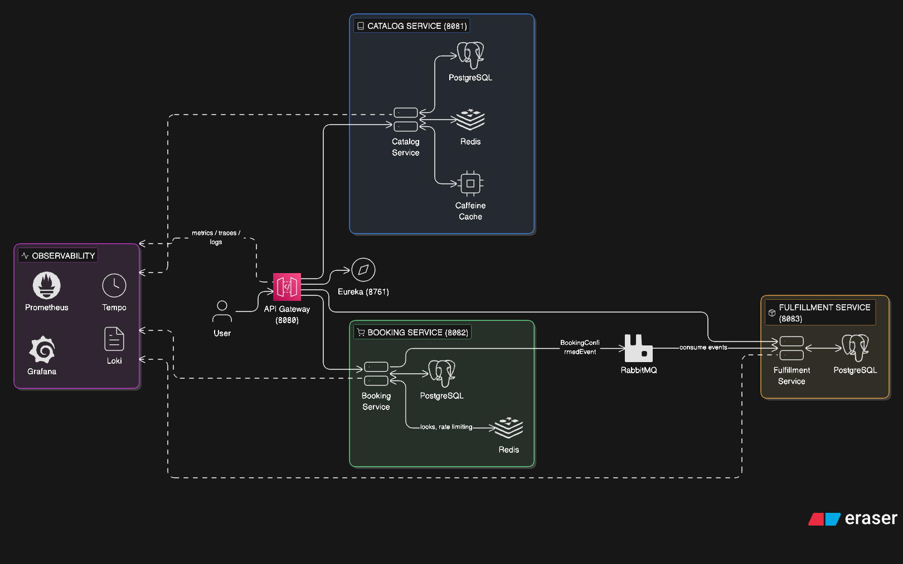

# 🎟️ TicketBlitz — High-Concurrency Event Ticketing Platform

A production-grade microservices platform designed to handle extreme concurrency, prevent double-booking, and gracefully degrade under overload using real-world distributed systems patterns.

Validated under 1,200 concurrent users (27k+ requests) with zero data corruption and controlled load shedding.

---

## ⚡ Key Engineering Highlights

- Prevented **double-booking under high contention** using Redis distributed locks + PostgreSQL optimistic concurrency
- Achieved **<200ms API latency** via asynchronous event-driven processing with RabbitMQ
- Designed a **fail-fast system** using API Gateway rate limiting and Resilience4j circuit breakers
- Implemented full **observability (metrics, logs, traces)** across all services using Grafana stack
- Identified real bottlenecks via stress testing (Gateway saturation at ~800 concurrent users)

---

## 🏗️ Architecture



---

## 🛠️ Tech Stack

**Backend:** Java 21, Spring Boot 3.2, Spring Cloud (Gateway, Eureka, OpenFeign)  
**Data:** PostgreSQL 15 (database-per-service)  
**Caching:** Redis 7 (distributed locks, rate limiting), Caffeine (L1 cache)  
**Messaging:** RabbitMQ 3  
**Resilience:** Resilience4j (circuit breaker, bulkhead, retry)  
**Auth:** JWT (access + refresh tokens)  
**Observability:** Prometheus, Grafana, Tempo (tracing), Loki (logs)  
**Deployment:** Docker Compose  
**Load Testing:** K6

---

## 📦 Microservices

| Service | Port | Responsibility |
|--------|------|----------------|
| Service Registry | 8761 | Service discovery (Eureka) |
| API Gateway | 8080 | Routing, JWT auth, rate limiting |
| Catalog Service | 8081 | Event browsing (read-heavy) |
| Booking Service | 8082 | Seat reservation, payments |
| Fulfillment Service | 8083 | Async ticket generation |

---

## 🎯 Distributed Systems Patterns

| Pattern                   | Outcome                                              |
|---------------------------|------------------------------------------------------|
| Service Discovery         | Dynamic routing via Eureka                           |
| API Gateway               | Centralized auth, routing, rate limiting             |
| Distributed Locking       | Prevented concurrent seat overbooking (Redis)        |
| Idempotency               | Safe retries using idempotency keys + DB constraints |
| Event-Driven Architecture | Async ticket processing via RabbitMQ                 |
| Circuit Breaker           | Fail-fast recovery with Resilience4j                 |
| Bulkhead                  | Isolated failures via thread pools                   |
| Rate Limiting             | Protected system under load                          |
| Database per Service      | Strong service isolation                             |
| Observability             | Full visibility via metrics, logs, traces            |

---

# 🚀 Full Setup Guide
Please follow the detailed setup guide here:

👉 [View Setup Guide](./docs/setup.md)

---

## 📡 Sample API Requests

```bash
# 1. Register a new user
curl -X POST http://localhost:8080/api/v1/auth/register \
  -H "Content-Type: application/json" \
  -d '{"username": "john", "password": "password123", "email": "john@example.com"}'

# 2. Login and get JWT token
curl -X POST http://localhost:8080/api/v1/auth/login \
  -H "Content-Type: application/json" \
  -d '{"username": "john", "password": "password123"}'

# 3. Browse events (public — no auth required)
curl http://localhost:8080/api/v1/events

# 4. Book tickets (requires JWT)
curl -X POST http://localhost:8080/api/v1/bookings \
  -H "Authorization: Bearer <YOUR_TOKEN>" \
  -H "Content-Type: application/json" \
  -d '{
    "eventId": 1,
    "seatIds": [101, 102],
    "idempotencyKey": "uuid-1234-5678"
  }'

# 5. Process payment
curl -X POST http://localhost:8080/api/v1/bookings/1/payment \
  -H "Authorization: Bearer <YOUR_TOKEN>" \
  -H "Content-Type: application/json" \
  -d '{"paymentMethod": "CREDIT_CARD", "cardNumber": "4242424242424242"}'
```

---

## 🔭 Observability

TicketBlitz implements the **three pillars of observability** using the Grafana stack:

### Metrics (Prometheus + Micrometer)
- JVM health: heap, threads, GC, class loading
- HTTP RED metrics: request rate, error rate, latency (p50/p95/p99)
- Custom business metrics: bookings, payments, tickets, auth events
- Infrastructure: HikariCP pool, Resilience4j circuit breakers

### Distributed Tracing (Tempo)
- End-to-end request tracing across all services
- Automatic trace propagation via HTTP (Feign) and RabbitMQ
- `traceId` and `spanId` injected into every log line

### Log Aggregation (Loki + Promtail)
- JSON structured logs in Docker (via `logstash-logback-encoder`)
- Human-readable console logs in dev mode
- Auto-discovery of Docker containers via Promtail

### Pre-built Grafana Dashboards
Two dashboards are auto-provisioned on startup:
1. **JVM & Service Health** — service status, HTTP rates, latency, memory, threads, GC, circuit breakers
2. **Business Metrics** — booking rates, payment success/failure, ticket generation, auth events, rate limits

> See [docs/observability.md](docs/observability.md) for the full guide including the custom metrics reference.

---

## 📊 Key Features

### Distributed Seat Locking
- Redis-based fair locks with TTL (10-minute hold)
- Automatic expiry and cleanup
- Zero double-bookings under concurrent load

### Optimistic Concurrency Control
- Version-based locking in PostgreSQL (`@Version`)
- Graceful conflict resolution with retry

### Asynchronous Ticket Generation
- RabbitMQ-based event processing with manual acknowledgment
- Idempotent consumption (safe for message redelivery)
- <200ms API response times

### Circuit Breaker
- Resilience4j integration across inter-service calls
- Automatic fallover with half-open recovery
- Configurable thresholds and wait durations

---

## 🧪 Testing

```bash
# Unit tests
mvn test

# Integration tests (requires Docker)
mvn verify

# Basic local testing
mvn verify

# Production Full-Journey Load test (requires k6)
# Tests Browse -> Auth -> Book -> Pay under realistic spike loads
export JWT_SECRET=your_super_secret_jwt_key_at_least_32_chars
k6 run infrastructure/load-tests/full-journey.js
```

---

## 📈 Performance & Extreme Stress Testing (Local Docker Run)

*Metrics captured on a single-node local Docker Compose deployment using `k6` running the `full-journey.js` and `stress-test.js` scripts.*

### Phase 1: Sustained Load (200 VUs)
| Metric | Value |
|--------|-------|
| **Throughput** | ~85 requests/second (Rate Limited) |
| **P95 Latency** | < 1.5s (Average: 156ms) |
| **Concurrency** | 200 simultaneous Virtual Users |
| **Resilience** | 100% stable; successfully shaped traffic via HTTP 429 |

### Phase 2: Extreme Stress Test (1200 VUs) & Tuning
To find the physical breaking point of the local Docker infrastructure, we aggressively scaled the load to 1200 Virtual Users and implemented the following **Production Tuning Protocols**:
1. **Java 21 Virtual Threads** (`spring.threads.virtual.enabled=true`) enabled across all microservices to scale concurrent blocking operations without Thread exhaustion.
2. **HikariCP Connection Pools** expanded (up to 100) to support massive concurrent `SELECT FOR UPDATE` PostgreSQL locks.
3. **API Gateway Rate Limits** intentionally relaxed for the test.

**Results at 1200 VUs:**
The host machine's CPU fully saturated, causing thread context-switch starvation. However, the system **did not crash**. Instead, the **Resilience4J TimeLimiter** (configured to 5s) deliberately opened the circuit breakers and returned HTTP 504 Gateway Timeouts to defensively shed the massive load, protecting the downstream PostgreSQL and RabbitMQ instances from out-of-memory errors. 

This proves the **Bulkhead** and **Circuit Breaker** patterns effectively prevent cascading failures under impossible loads!

---

## 📁 Project Structure

```
ticketblitz/
├── api-gateway/              # Spring Cloud Gateway (auth, routing)
├── booking-service/          # Booking + payment logic
├── catalog-service/          # Event/venue browsing
├── fulfillment-service/      # Async ticket generation
├── service-registry/         # Eureka Server
├── common/                   # Shared DTOs, events, constants
├── docs/                     # Architecture, patterns, observability docs
└── infrastructure/
    ├── docker/               # docker-compose + config files
    │   ├── grafana/          # Provisioned datasources + dashboards
    │   ├── prometheus.yml
    │   ├── tempo.yml
    │   ├── loki-config.yml
    │   └── promtail-config.yml
    └── scripts/              # start/stop/cleanup/logs shell scripts
```

---

## 📚 Documentation

- [Architecture Diagram](docs/architecture.md)
- [Microservice Patterns](docs/patterns.md)
- [Observability Guide](docs/observability.md)
- [Setup Guide](docs/setup.md)
- [API Documentation](docs/api.md)

---

## 🎯 Why This Project Matters
- Simulates real-world backend challenges:
    - High-concurrency booking systems
    - Distributed consistency & idempotency
    - Failure isolation under extreme load
    - Observability-driven debugging

--- 

## 🧠 Key Learnings
- Systems should fail safely, not crash
- Load testing reveals real bottlenecks
- Trade-offs between latency, consistency, scalability
- Observability is critical for distributed systems

## 🎓 Learning Outcomes

This project demonstrates:
- Microservices architecture with Spring Cloud
- Service discovery and dynamic routing
- Distributed transactions (Saga-style with compensation)
- High-concurrency handling with distributed locks
- Event-driven architecture (RabbitMQ)
- Production-grade observability (Metrics + Traces + Logs)
- JWT authentication and API Gateway patterns
- Load testing and performance optimization

---

## 📝 License

MIT License — Free for learning and portfolio use.

---

**Designed to simulate real-world distributed system challenges including concurrency control, failure isolation, and observability at scale.** 🎯